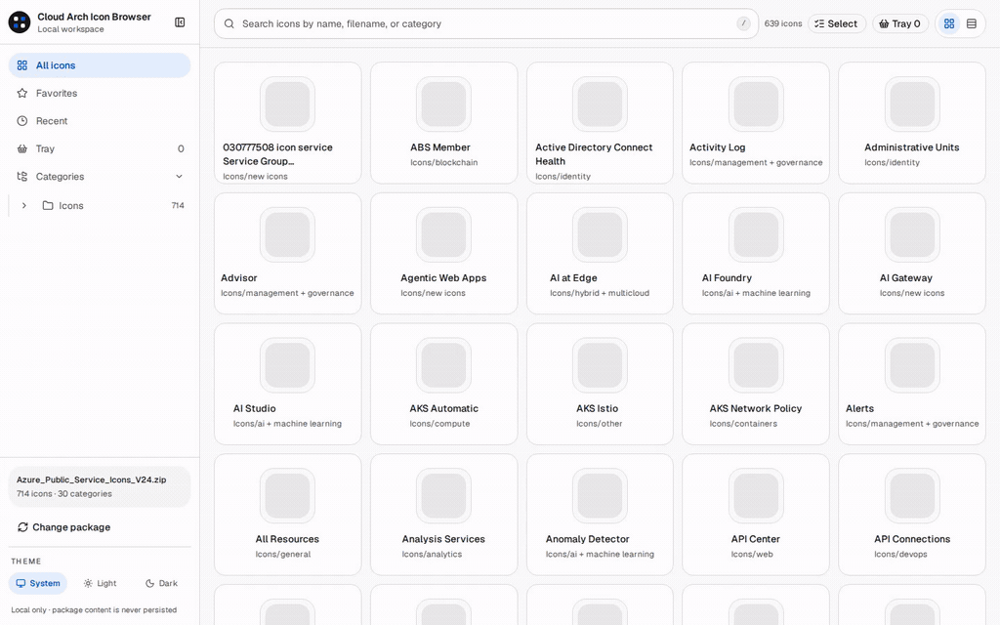

# Cloud Arch Icon Browser

Find Microsoft Azure Architecture Icons quickly and copy them into PowerPoint, Excel, or other compatible apps.



Cloud Arch Icon Browser is an independent open-source project. It is not affiliated with, endorsed by, or sponsored by Microsoft. Microsoft Azure Architecture Icons are not included in this repository or npm package.

## Quick start

1. Download the official Azure Architecture Icons ZIP from [Microsoft Learn](https://learn.microsoft.com/en-us/azure/architecture/icons/).
2. Run:

   ```bash
   npx @shimabell06/cloud-arch-icon-browser
   ```

3. Choose the downloaded ZIP in the browser.

The command serves the app from the stable local origin `http://127.0.0.1:41731/` and opens it in your default browser. A second invocation reuses the same running app; if another process occupies that port, the CLI reports an error rather than switching origins. The selected ZIP is processed locally and its bytes are never uploaded or copied into application storage.

On browsers that support the File System Access API, a successfully validated selection can remember only the local file handle in IndexedDB. A later launch can use `Open previous ZIP` to request/read that file under normal browser permission rules, and `Forget previous ZIP reference` removes the handle. The app does not trigger a file-permission prompt automatically on page load. Unsupported browsers continue to use the normal ZIP picker.

## Features

- Fast search across icon names, original filenames, and category paths.
- Category browsing with explicit search filter chips.
- Favorites, recently used icons, recent searches, Frequently used shortcuts, Tray, Saved Sets, and Grid / Compact views.
- Centered icon details with real package metadata.
- Copy icons as transparent 512×512 PNG images for compatible clipboard workflows such as Windows PowerPoint and Excel.
- Copy original SVG source text where supported or download the original SVG with its original filename.
- Experimental Windows PowerPoint `Copy all` from the Tray in the packaged `npx` runtime, preserving Tray order and quantities without a flattened-image fallback.
- System, Light, and Dark themes with responsive keyboard-accessible navigation.
- Local-only package processing with no automatic runtime network access; supported browsers can remember only a local file reference for the previous ZIP.

`Copy image` depends on browser Clipboard API support and permission. If image clipboard writes are unavailable or denied, the app reports the failure and the original SVG remains available for download.

### Experimental PowerPoint Copy all

On Windows, the packaged `npx` runtime exposes an explicitly Experimental `Copy all` action in the Tray. It prepares up to 36 transient 512×512 PNG representations, preserves Tray order and quantities, asks desktop PowerPoint to copy them as a multi-shape selection, and then lets you paste once in PowerPoint. Generated PNGs and temporary Office files stay local and are deleted after the operation. There is no cloud service and no flattened combined-image fallback.

This workflow is **not yet formally supported** because real-machine Windows 11 + current Chromium + Microsoft 365 PowerPoint validation is still pending. The UI shows an Experimental warning on first use. If the later validation fails, the feature will be disabled or removed rather than replaced by a flattened image.

The feature is enabled by default for evaluation. To disable it locally, run this in the app's browser developer console and reload:

```js
localStorage.setItem(
  "cloud-arch-icon-browser:feature:powerpoint-copy-all",
  "off",
);
```

Delete that key (or set it to `on`) to return to the built-in default. The existing single-icon `Copy image` workflow remains the stable cross-platform baseline.

True vector clipboard copy and direct browser-to-PowerPoint drag are not part of this Experimental release. The `Copy SVG source` action copies SVG markup text; it is not a vector-image clipboard operation.

## Official Azure icons

Download the current package from [Microsoft Learn](https://learn.microsoft.com/en-us/azure/architecture/icons/) and use the icons in accordance with Microsoft's terms.

The latest package explicitly verified by this project is recorded in [`COMPATIBILITY.md`](./COMPATIBILITY.md). The runtime validates package structure rather than hard-coding a specific Microsoft ZIP version.

## Development

Use the Node.js version pinned in [`.node-version`](./.node-version):

```bash
nvm install
nvm use
npm ci
npm run dev
```

Common validation commands:

```bash
npm run check
npm run typecheck
npm test
npm run build
npm run test:e2e
```

### Regenerate the README demo

Install Playwright Chromium and `ffmpeg`, then run the recorder with a maintainer-downloaded official Azure Architecture Icons ZIP:

```bash
npx playwright install chromium
AZURE_ICON_ZIP=/path/to/Azure_Public_Service_Icons.zip npm run docs:demo
```

The recorder starts the local app, performs the search → details → Copy image flow with Playwright, and writes `docs/assets/demo.gif`. The source ZIP and SVG files are never copied into the repository.

## Project docs

- [`DESIGN.md`](./DESIGN.md) — product and architecture design contract.
- [`CONTRIBUTING.md`](./CONTRIBUTING.md) — contribution workflow and development details.
- [`COMPATIBILITY.md`](./COMPATIBILITY.md) — official package compatibility status.
- [`docs/RELEASE.md`](./docs/RELEASE.md) — release and maintenance runbook.
- [`SECURITY.md`](./SECURITY.md) — vulnerability reporting policy.

## License

The project source code is licensed under the MIT License. See [`LICENSE`](./LICENSE).

Third-party software and assets retain their own licenses. See [`THIRD_PARTY_NOTICES.md`](./THIRD_PARTY_NOTICES.md). Microsoft Azure Architecture Icons are Microsoft assets and are not covered by this project's MIT License.
